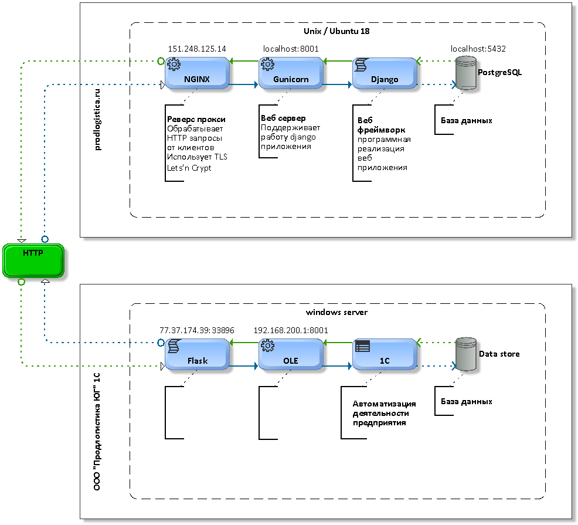

# Коммерческая платформа для компании ООО "Продлогистика Юг"
>djangocms / python
## Запуск dev-mode
Установка зависимостей

```shell script
    npm install
```

Запуск gulp сервера
```shell script
    gulp
```

Запуск django сервера (для разаработки)
```shell script
    manage.py runserver --insecure
```

## Build

```shell script
    gulp build
```
    
## Структура платформы   



## Деплой проекта и настройка сервера (ubuntu 18.04)
#### Новый пользователь:
```shell script
    adduser www
    usermod -aG sudo www
```

#### Конфигурация локалей:
Выбрать <b>[*] ru_RU.UTF-8 UTF-8</b> и установить по умолчанию.

```shell script
    sudo localedef ru_RU.UTF-8 -i ru_RU -fUTF-8 ; \export LANGUAGE=ru_RU.UTF-8 ; \export LANG=ru_RU.UTF-8 ; \export LC_ALL=ru_RU.UTF-8 ; \sudo locale-gen ru_RU.UTF-8 ; \sudo dpkg-reconfigure locales
```


#### Настройка ssh:

```shell script
    sudo vim /etc/ssh/sshd_config
        AllowUsers www
        PermitRootLogin no
    
        # if ssh key registred
        # PasswordAuthentication no
    
    
    and restart
    sudo service ssh restart
```

#### Установка python 3.8:

```shell script
    sudo apt install build-essential checkinstall
    sudo apt install libreadline-gplv2-dev libncursesw5-dev libssl-dev libsqlite3-dev tk-dev libgdbm-dev libc6-dev libbz2-dev libffi-dev zlib1g-dev
    
    cd /opt
    sudo wget https://www.python.org/ftp/python/3.8.1/Python-3.8.1.tgz
    sudo tar xzf Python-3.8.1.tgz
    
    cd Python-3.8.1
    sudo ./configure --enable-optimizations
    sudo make altinstall
    sudo rm -f ../Python-3.8.1.tgz
    
    python3.8 -V
```

#### Установка пакетов + ZSH:
```shell script
    sudo apt-get install -y zsh tree redis-server nginx libssl-dev zlib1g-dev libbz2-dev libreadline-dev libsqlite3-dev llvm libncurses5-dev libncursesw5-dev xz-utils tk-dev libffi-dev liblzma-dev python3-dev python-imaging python3-lxml libxslt-dev python-libxml2 python-libxslt1 libffi-dev libssl-dev python-dev gnumeric libsqlite3-dev libpq-dev libxml2-dev libxslt1-dev libjpeg-dev libfreetype6-dev libcurl4-openssl-dev screenfetch supervisor
```

#### Установка oh-my-zsh:
```shell script
    cd ~
    sh -c "$(curl -fsSL https://raw.githubusercontent.com/robbyrussell/oh-my-zsh/master/tools/install.sh)"
```

### colored nginx conf
```shell script
    mkdir -p ~/.vim/syntax/ && cd ~/.vim/syntax/ && wget -O nginx.vim 'http://www.vim.org/scripts/download_script.php?src_id=12990' && echo "au BufRead,BufNewFile /etc/nginx/* set ft=nginx" >> ~/.vim/filetype.vim && touch ~/.vimrc && echo ":syntax on" >> ~/.vimrc
```

#### Install certbot and letncrypt
#### Configure nginx
#### gunicorn
#### postgreSQL
#### supervisor 

